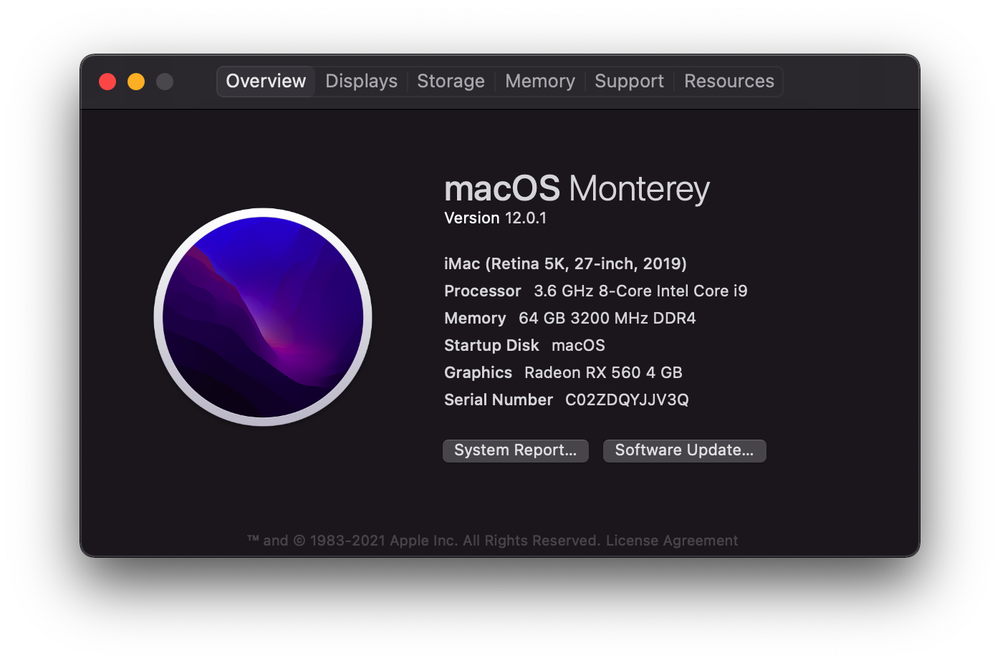

# OpenCore Bootloader ROG-STRIX-Z390-I-GAMING-Hackintosh

OpenCore 0.6.8

Guide used [OpenCore Vanilla](https://khronokernel.github.io/Opencore-Vanilla-Desktop-Guide/), I highly suggest reading through all of it and going through and creating your own `config.plist` even if it's just to understand the inner workings of OpenCore. Directly copying my `config.plist` may not work if you do not have the exact components that I do.

This has been tested and is running on 10.14.x, 10.15.x, 11.x.

## Hardware

 - CPU: Intel i9 9900K
 - Motherboard: ROG STRIX Z390-I GAMING
 - M2 Hard Disk: Samsung 970 EVO PLUS 500G NVME M.2
 - Heat sink: NOCTUA NH-U12A
 - Heat sink: NF-F12 industrialPPC-3000 PWM
 - Heat sink: NF-F12 industrialPPC-3000 PWM
 - GPU: SAPPHIRE Radeon RX 5700 XT 8GB Nitro+ Special Edition
 - RAM: Corsair DDR4 3200 C16 64GB (32GB x2)
 - Chassis: INWIN A1 Plus
 - Power: Corsair SF750
 - WiFI: BCM94352z/DW1560 (replace onboard card)

## links

 - https://khronokernel.github.io/Opencore-Vanilla-Desktop-Guide
 - https://www.asus.com/Motherboards/ROG-STRIX-Z390-I-GAMING
 - https://github.com/rusty-bits/OC-tool

## Working

- iServices
- Audio
- airport and WiFi (replace onboard card to BCM94352z/DW1560)

### USB Port Mapping

Selected XHC ports (max 15)

| Ports | Type | Description |
| --- | --- | --- |
| HS01 | USB 2 and USB 3 Type C connector with Switch | Front USB Type-C |
| HS05 | USB 2 Type A connector | Rear USB 2.0 (black) |
| HS06 | USB 2 Type A connector | Rear USB 2.0 (black) |
| HS07 | USB 3 Standard-A connector | Rear USB 3.1 Gen 1 (blue) |
| HS08 | USB 3 Standard-A connector | Rear USB 3.1 Gen 1 (blue) |
| HS09 | USB 3 Standard-A connector | Front USB 3.1 Gen 1 |
| HS10 | USB 3 Standard-A connector | Front USB 3.1 Gen 1 |
| HS14 | Internal connector | Bluetooth/Wifi - BCM94352z Hub |
| SS01 | USB 2 and USB 3 Type C connector with Switch | Front USB Type-C |
| SS03 | USB 3 Standard-A connector | Rear USB 3.1 Gen 2 (red) |
| SS04 | USB 3 Standard-A connector | Rear USB 3.1 Gen 2 (red) |
| SS07 | USB 3 Standard-A connector | Rear USB 3.1 Gen 1 (blue) |
| SS08 | USB 3 Standard-A connector | Rear USB 3.1 Gen 1 (blue) |
| SS09 | USB 3 Standard-A connector | Front USB 3.1 Gen 1 |
| SS10 | USB 3 Standard-A connector | Front USB 3.1 Gen 1 |

## Kexts

### Generic

- Lilu.kext
- WhateverGreen.kext
- VirtualSMC.kext
- SMCProcessor.kext
- SMCSuperIO.kext
- AppleALC.kext
- USBInjectAll.kext (disabled)

### System specific

- IntelMausiEthernet.kext

### WiFi and Bluetooth
 - BrcmBluetoothInjector.kext
 - BrcmFirmwareData.kext
 - BrcmPatchRAM3.kext
 - AirportBrcmFixup.kext

### Custom

You should generate these yourself if you're not using my exact component list.

- USBPorts.kext (generate by using USBInjectAll.kext and Hackintool)

## ACPI

### System specific

- SSDT-PLUG.aml
- SSDT-EC-USBX.aml
- SSDT-AWAC.aml
- SSDT-PMC.aml

### Custom

- FixShutdown-USB-SSDT.aml
- SSDT-HPET.aml (generated via your own DSDT.dsl file)
- SSDT-UIAC.aml (USB Port mapping, generated via Hackintool along side USBPorts.kext)

## Tools

- Hackintool
- PlistEdit Pro (VS Code works just as well, but PlistEdit Pro is probably more user friendly)
- The following from Corpnewt
  - SSDTTime
  - MountEFI
  - gibMacOS
  - FixHPET

## Gotchas & Troubleshooting

1. `agdpmod=pikera` is required in NVRAM > Add > 7C436110-AB2A-4BBB-A880-FE41995C9F82 > boot-args, otherwise you'll get a black screen.
2. The system will throw an error regarding POST on every reboot unless `SAT0 to SATA`, `_Q11 to XQ11` and `_Q12 to XQ12` are included in ACPI > Patch.
3. If you need to generate a .aml file, use `$ ./iasl <path to .dsl>`, this tool is located in the `Scripts` folder when you run any of CorpNewts tools (MountEFI is probably the first one you'll use).
4. Generating your own systems `DSDT.aml` (used as the basis for any of your custom SSDT files) file is best done in Windows using CorpNewts SSDTTime tool.
